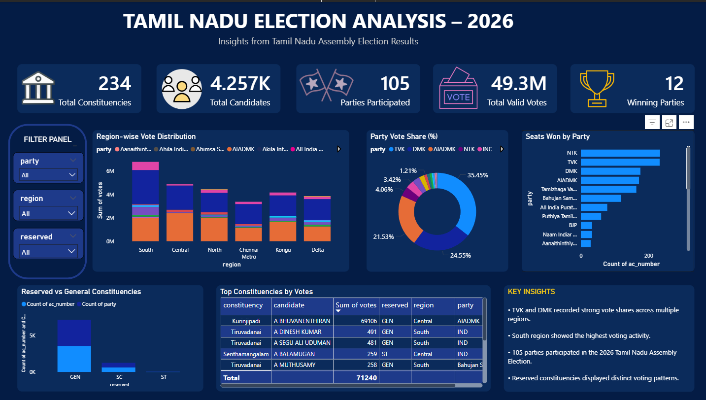

Tamil Nadu Election Analysis 2026 Dashboard 🗳️📊

Overview

The Tamil Nadu Election Analysis 2026 Dashboard is an interactive Power BI project created as part of the Codebasics Resume Project Challenge.

This project focuses on analyzing election-related trends, regional voting patterns, constituency performance, and party-wise vote distribution through interactive visualizations and data storytelling techniques.

The dashboard transforms raw election data into meaningful analytical insights using Power BI, Power Query, and DAX.

---

Dashboard Preview

https://github.com/Balaji-Analytics/Tamil-Nadu-Election-Analysis-2026/blob/db6bd1305e94f522da5b14df7103fbce00fcf69a/TN%20Election%20Dashboard.png

---

Project Objectives

- Analyze regional voting patterns across Tamil Nadu
- Compare party-wise vote share and seat distribution
- Study reserved vs general constituency trends
- Identify top-performing constituencies
- Build an interactive and visually engaging dashboard
- Present insights through data storytelling

---

Dashboard Features

✅ Interactive KPI Cards
✅ Region-wise Vote Distribution
✅ Party Vote Share Analysis
✅ Seats Won by Party
✅ Reserved vs General Constituency Analysis
✅ Top Constituencies by Votes
✅ Interactive Filter Panel
✅ Insight-driven Dashboard Design

---

Tools & Technologies Used

Tool| Purpose
Power BI| Dashboard Development
Power Query| Data Cleaning & Transformation
DAX| KPI Calculations & Measures
Data Modeling| Table Relationships
Data Visualization| Interactive Reporting

---

Key Insights

- TVK and DMK recorded strong vote shares across multiple regions.
- South region showed high voting activity.
- Chennai Metro displayed distinct voting patterns.
- More than 100 political parties participated in the election dataset.
- Reserved constituencies demonstrated different vote distribution trends.

---

Dataset Information

Datasets used in this project:

- tn_2021_results.csv
- tn_2026_results.csv
- constituency_master.csv

The datasets contain:

- Constituency details
- Candidate information
- Party-wise vote distribution
- Region mapping
- Reserved constituency classification

---

Project Structure

Tamil-Nadu-Election-Analysis-2026
│
├── TN Election Dashboard.png
├── TN_Election_Analysis.pbix
├── TN_Election_Insights_Report_DarkTheme.docx
├── README.md
│
└── dataset
    ├── tn_2021_results.csv
    ├── tn_2026_results.csv
    └── constituency_master.csv

---

Skills Demonstrated

- Data Visualization
- Dashboard Design
- Data Storytelling
- Analytical Thinking
- Power BI Development
- Data Cleaning & Transformation
- Interactive Reporting

---

Challenges Faced

- Managing multiple datasets and relationships
- Designing a balanced dashboard layout
- Creating a consistent dark-theme design
- Improving visual hierarchy and readability

---

Conclusion

This project helped strengthen my Power BI dashboard development, visualization, and analytical storytelling skills while working on a real-world style election dataset.

---

Author

Balaji

Aspiring Data Analyst | Power BI Enthusiast

GitHub

https://github.com/Balaji-Analytics

LinkedIn

https://www.linkedin.com/in/balaji-nadar
